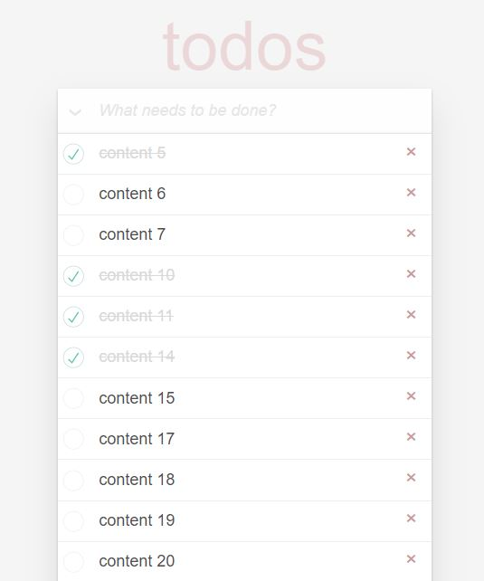

# React To-Do App

### `npm start`

Runs the app in the development mode.\
Open [http://localhost:3000](http://localhost:3000) to view it in your browser.

The page will reload when you make changes.\
You may also see any lint errors in the console.

## Project Features

:heavy_check_mark: In this project, the data is taken from the project we created on the https://mockapi.io/ site.  
:heavy_check_mark: State management in the project was done with Redux-Redux Toolkit.  
:heavy_check_mark: You can add tasks to be done from the input field.  
:heavy_check_mark: When the input field is empty, you cannot add a task and you will receive a warning.  
:heavy_check_mark: The created to-do tasks are listed in the Todo List section.  
:heavy_check_mark: User can delete, edit and complete the 'todo'.  

## :fire: Technologies and Libraries

:point_right: React.js  
:point_right: Redux  
:point_right: Redux Toolkit  
:point_right: Axios  

## Screenshot

